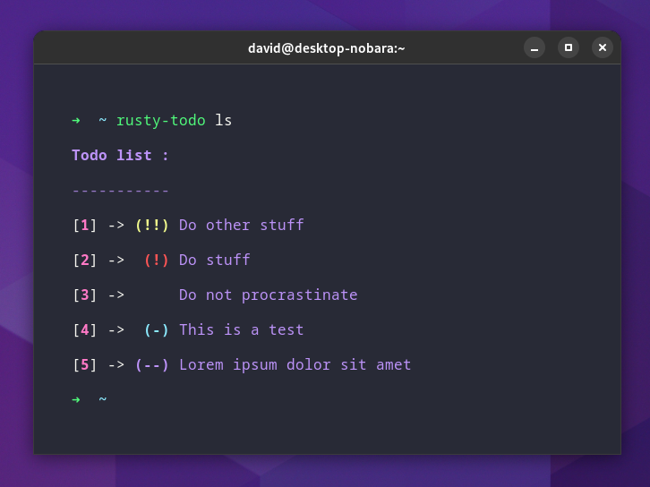

# rusty-todo
------------
```rusty-todo``` is, by design, a very simple to use and colorful Command Line Interface (CLI) todo list manager.

# Screenshots



# Getting started

The help message describes all the available commands to add, remove, mark as done and change the priority of an entry:

```
➜  ~ rusty-todo --help
rusty-todo 0.1.0
dvidbruhm
A simple and colorful CLI todo list manager

USAGE:
    rusty-todo [OPTIONS] [SUBCOMMAND]

OPTIONS:
    -h, --help               Print help information
    -t, --todo-dir <FILE>    Sets a directory path for the todo files
    -V, --version            Print version information

SUBCOMMANDS:
    add           Add item to the todo list [aliases: a]
    clear         Delete all items in todo list [aliases: cl]
    clear-done    Delete all items in done list [aliases: cld]
    done          Mark an item as done [aliases: d]
    help          Print this message or the help of the given subcommand(s)
    insert        Insert item to todo list at position number [aliases: in]
    list          List all todo [aliases: ls]
    list-all      List all todo and done items [aliases: lsa]
    list-done     List all done items [aliases: lsd]
    priority      Changes the priority of an item [aliases: p]
    remove        Delete item from todo list by number [aliases: rm, del]
    replace       Replace an item with updated text [aliases: re]
    undone        Unmark an item as done [aliases: undo, ud]
```

## Usage

The updated todo list will be printed after every operation. All commands have a shorter alias that can be used as shown in the help message (for example the alias for ```add``` is ```a```).

To add an item:
```
rusty-todo add "This is a new task"
```

To list the tasks in the todo-list:
```
rusty-todo ls

Todo list : 
-----------
[1] ->      This is a test
```

There are 5 (from 1 to 5, 1 being highest priority) priority level that can be changed for each task. To change a task priority by using the task number (first input is task number, second input is priority level):
```
rusty-todo p 1 1

Todo list : 
-----------
[1] -> (!!) This is a test
```

Remove an item by using the task number:
```
rusty-todo remove 1
```

Mark an item as done by using the task number:
```
rusty-todo done 1
```

Undo a done item and reinsert in the todo list:
```
rusty-todo undo 1
```

List all the list of done tasks:
```
rusty-todo list-done
```

List both the todo list and done list:
```
rusty-todo list-all

Todo list : 
-----------
[1] ->      This is a test

Done list : 
-----------
[1] -> [2023-04-05] -      This is a done task
```

Clear (remove) all tasks in the todo (or done) list:
```
rusty-todo clear
rusty-todo clear-done
```

Add a new task at a specific number (instead of adding to the end of the list):
```
rusty-todo insert 2 "Inserting at the second position in the list"
```


## Installation

### With a release

Download the binary release and move it somewhere in your path.

### Using cargo

Download the source code and ```cargo run``` inside the project folder to generate a binary in the target folder.
